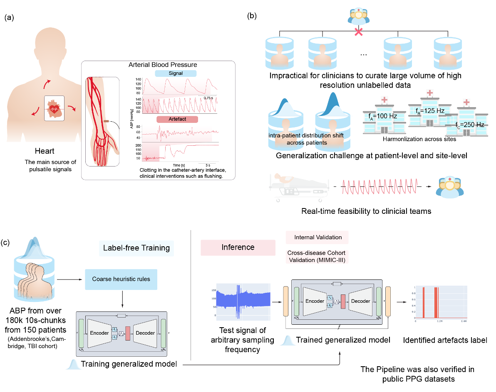

# Generalised Label-free Artefact Cleaning for Real-time Medical Pulsatile Time Series

This is the pytorch implementation of GenClean 

The architecture of our model(FedFDD) is shown as below:



## Setup

### 1. Create conda/mamaba environment(Optional)
```
mamba create -n GenClean -y python=3.9.16
mamba activate GenClean
```

### 2. Install dependecies
Install the required packages
```
pip install -r requirements_cpu.txt
```

### 3. Prepare the data and Train (see the Example Usage)


## Example Usage

Here we provided three modalities with our plugin to use.

- ICP (including HDF5 reader usage and model training)
- ABP (including abp_artf_plugin usage)
- PPG (including abp_artf_plugin usage)

## Citation

If you find this repo useful, please cite our paper.

```
<will release later>
```

## Contact

If there are any issues, please ask in the GitHub Issue module or contact Aiden (xc369@cam.ac.uk).

## Acknowledgement

We appreciate the following github repos a lot for their valuable code base:

https://github.com/tedinburgh/deepclean
